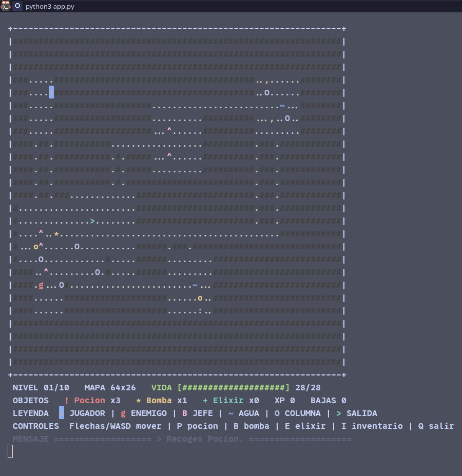

# Ashen Crypt

**Ashen Crypt** es un roguelike ASCII por turnos para la terminal, disponible en espanol e ingles.

> Explora una cripta procedural, derrota enemigos, consigue objetos y sobrevive diez niveles en una aventura de terminal sin dependencias externas.

## Vista previa



Explora diez niveles procedurales, derrota enemigos cada vez mas peligrosos, consigue objetos y vence a los dos jefes de la cripta. No necesita paquetes externos: solo Python 3.

## Instalacion

### Linux y macOS

Necesitas [Python 3](https://www.python.org/downloads/). Abre una terminal y ejecuta:

```bash
git clone https://github.com/WLDluv-stack/ash-crypt-roguelike.git
cd ash-crypt-roguelike
python3 app.py
```

Tambien puedes descargar el proyecto como ZIP desde **Code > Download ZIP** y ejecutar `python3 app.py` dentro de la carpeta.

### Windows

Instala [Python 3 para Windows](https://www.python.org/downloads/windows/) y activa **Add Python to PATH** durante la instalacion. En PowerShell o CMD ejecuta:

```powershell
git clone https://github.com/WLDluv-stack/ash-crypt-roguelike.git
cd ash-crypt-roguelike
python app.py
```

Tambien puedes hacer doble clic en `run_game.bat`. El juego usa la consola de Windows, acepta las flechas directamente y no requiere instalar paquetes.

Tambien puedes descargar el ZIP desde **Code > Download ZIP**, extraerlo y ejecutar `run_game.bat`.

## Jugar

```bash
python3 app.py
```

Al iniciar aparece una pantalla de bienvenida. Pulsa `S` para jugar en espanol o `E` para jugar en ingles; despues pulsa `Enter` para comenzar.

El idioma elegido traduce el titulo, el HUD, la leyenda, los controles y las pantallas de transicion.

Controles: flechas o `W`, `A`, `S`, `D` para moverte y atacar; `P` usa una pocion, `B` lanza una bomba, `E` usa un elixir, `I` muestra el inventario y `Q` sale. Las teclas se leen al instante, sin pulsar `Enter`.

Al derrotar al ultimo enemigo del nivel aparece una pantalla de nivel completado. Debes pulsar `Enter` para confirmar y descender al siguiente nivel. Los mapas crecen solo horizontalmente, desde `64x26` hasta `208x26`. La cantidad de enemigos esta limitada y aumenta poco a poco para mantener la partida manejable. Hay jefes en los niveles 5 y 10.

## Leyenda clara

| Simbolo | Significado |
| --- | --- |
| `@` | Jugador, con fondo azul brillante |
| `g`, `o`, `v`, `c` | Enemigos |
| `B` | Jefe |
| `~` | Agua, bloquea el paso |
| `O` | Columna, bloquea el paso |
| `,`, `:` | Escombros y restos decorativos |
| `;` | Musgo |
| `^` | Cristal |
| `>` | Salida visual del mapa |

Las paredes, el agua y las columnas tambien afectan al movimiento de los enemigos, pero los corredores principales siempre quedan abiertos para que ningun obstaculo bloquee el avance. El panel del juego muestra siempre el nivel, el tamano del mapa, la vida, los objetos, la experiencia, las bajas, la leyenda y los controles.

## Objetos

- `!` Pocion: recupera vida al pulsar `P`.
- `*` Bomba: hiere a todos los enemigos cercanos al pulsar `B`.
- `+` Elixir de vigor: cura 14 puntos, anade +4 de dano por golpe y reduce a la mitad el dano recibido durante 8 turnos al pulsar `E`.

Los objetos se recogen caminando sobre ellos. El inventario aparece bajo el mapa y se puede consultar con `I`. El estado activo del elixir y sus turnos restantes tambien aparecen en el panel.

La interfaz usa colores ANSI cuando la terminal los admite: jugador con fondo azul, agua azul brillante, columnas blancas, escombros amarillos, musgo verde, cristales magenta, objetos de colores y enemigos contrastados. Durante los niveles con jefe aparece tambien su barra de vida.

Para repetir un mapa concreto:

```bash
python3 app.py --seed 7
```
